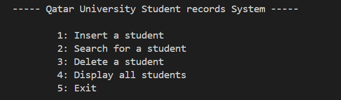
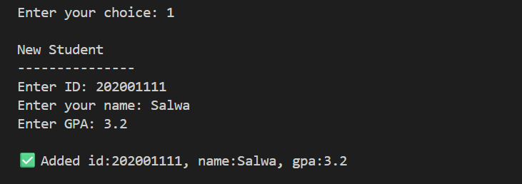
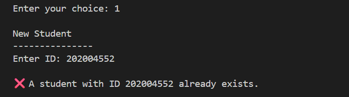
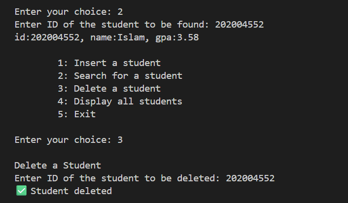
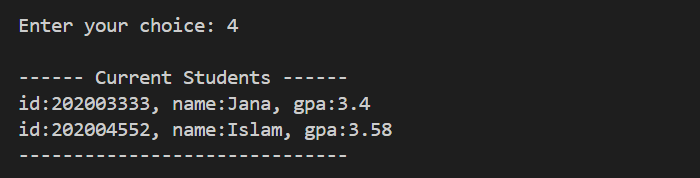
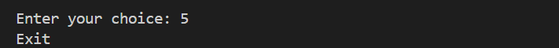

# 🗃️ QU Student Records System

> **CMPS303 – Data Structures | Qatar University**  
> **Spring 2022 – Second Year, Third Semester**

Java console application developed for CMPS303 (Data Structures) at Qatar University. Implements a hybrid data structure (Hash Table of Trees) to manage and optimize student records with insert, search, and delete operations.

---

## 📌 Overview

The system models Qatar University's student records management, where each student has:
- `ID` (composed of admission year + unique number)
- `Name`
- `GPA`

### Menu Functionality:
```
1. Insert a new student  
2. Search for a student  
3. Delete a student
4. Display all students
5. Exit and save data
```

All records are stored and retrieved using **object serialization**, allowing the program to persist data across sessions.

---

## 🚀 Key Features

- ✅ **Insert, Search, Delete, Display** operations via a console interface  
- 🧠 **Custom data structure** combining Hash Tables and Trees for efficiency  
- 💾 **Persistent storage** using Java Serialization (`.dat` file)  
- 📊 **Performance comparison** with alternative ADTs (chaining, nested hash tables, etc.)  
- 📂 Clean package structure with separation of concerns  

---

## 🧠 Data Structure: Hash Table of Trees

Each bucket of the hash table contains a **Binary Search Tree** storing students admitted in a specific year. The student ID format helps optimize search ranges by year-based hashing.

### Complexity Comparison

| Operation | Our Option (B): Hash Table of Trees | Option A: Chaining | Option C: Nested Hash Table | Option D: Tree of Linked Lists |
|-----------|--------------------------------------|--------------------|-----------------------------|--------------------------------|
| Insert    | O(log n)                             | O(n)               | O(1)                        | O(log n)                       |
| Delete    | O(log n)                             | O(n)               | O(1)                        | O(n log n)                     |
| Search    | O(log n)                             | O(n)               | O(1)                        | O(n log n)                     |
| Memory    | Medium                               | Moderate           | High                        | Low                            |

---

## 📁 Project Structure

```
qu-student-records-system-DS/
├── src/
│   ├── Node.java
│   ├── Student.java
│   ├── Tree.java
│   ├── TreeInHashTable.java
│   └── Tester.java
├── HashArray.dat       # auto-generated at runtime
├── screenshots/        # your UI output screenshots
└── README.md

```

---

## 🛠 How to Run

1. Open the project in any Java IDE (e.g., Eclipse, IntelliJ).
2. Ensure all `.java` files are in the same `src/` directory.
3. Run `Tester.java` to launch the system.
4. Interact via the console menu.

> ⚠️ The application will load saved data from `HashArray.dat` if available.

---

## 👨🏻‍💻 Team Members

- **Islam Hamdi** – 202004552  
- Fatima Mahgoub – 202007684  
- Najah Alnounou – 202006879  
- Salma Badawy – 202007736  

---

## 📸 Screenshots

Below are key actions performed in the system, with explanations of what happens internally in the data structure.

---

### 🟢 1. Menu on Startup



🧠 *Explanation:*  
This is the entry point of the program where the user selects one of the core operations. No data structure is affected yet.

---

### 🟩 2. Insert a Student



🧠 *Explanation:*  
- The system parses the **Qatar University ID**, calculates the hash using `(id / 100000) - 2000`, and determines the correct bucket.
- A **new node is inserted** into the Binary Search Tree (BST) within that bucket, maintaining sorted order by key.

---

### 🟨 3. Prevent Duplicate Insertion



🧠 *Explanation:*  
Before insertion, the system checks if the BST already contains the key (last 5 digits of ID).  
If found, it **rejects the insertion** to avoid duplicate entries in the hash bucket’s tree.

---

### 🟦 4. Search & Delete a Student



🧠 *Explanation:*  
- **Search:** Locates the correct bucket via hashing and performs a **BST search**.
- **Delete:** If the node is found, it is removed from the tree while preserving BST structure (leaf, one child, or two children case).

---

### 🟪 5. Display All Students



🧠 *Explanation:*  
- Traverses each non-null bucket in the hash array.
- Calls **in-order traversal** on each BST to print students in sorted order by key (ID suffix).

---

### 🟥 6. Exit & Data Serialization



🧠 *Explanation:*  
- On exit, the entire `Tree<Student>[]` hash array is serialized and written to `HashArray.dat`.
- Upon restart, the system restores the same tree structures from disk.

---

## 📜 License

This project is for educational purposes only and was developed for coursework at Qatar University.
